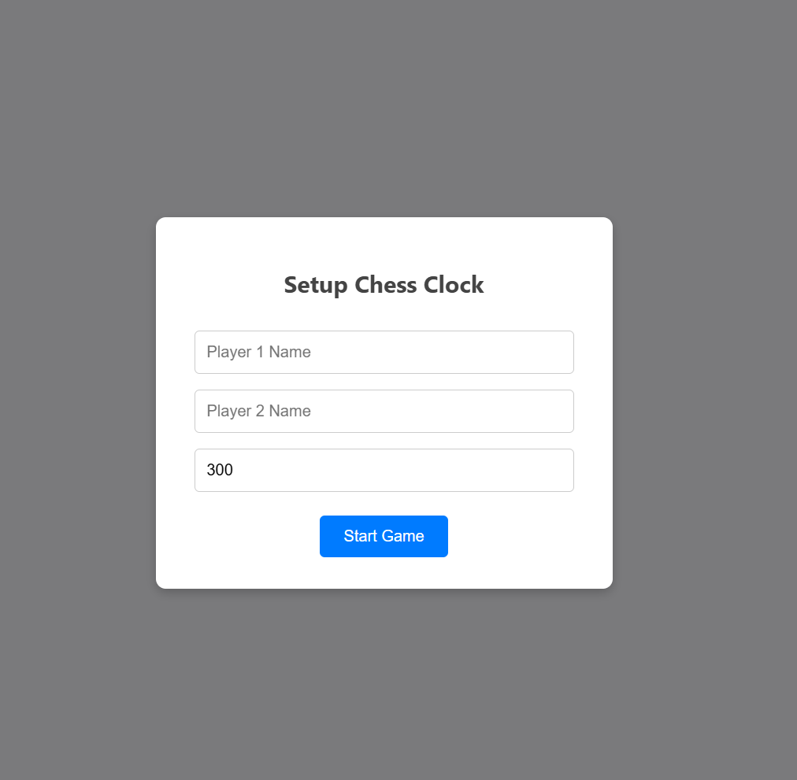
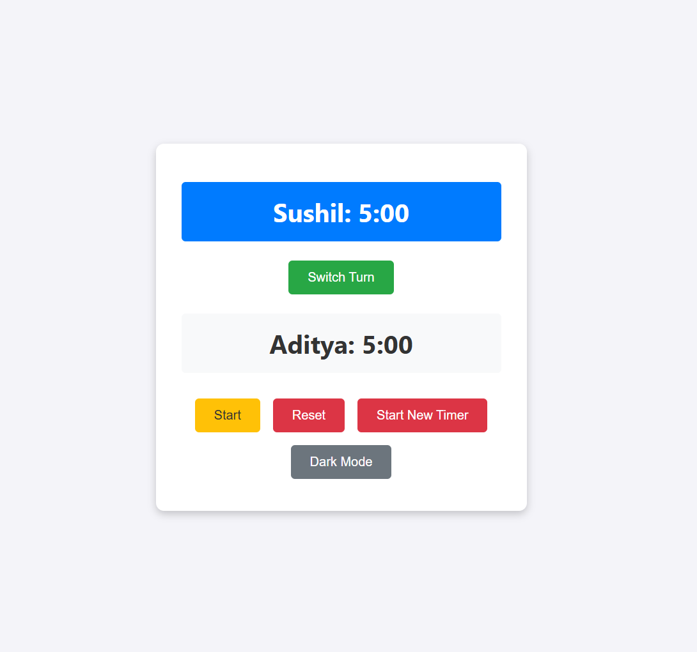
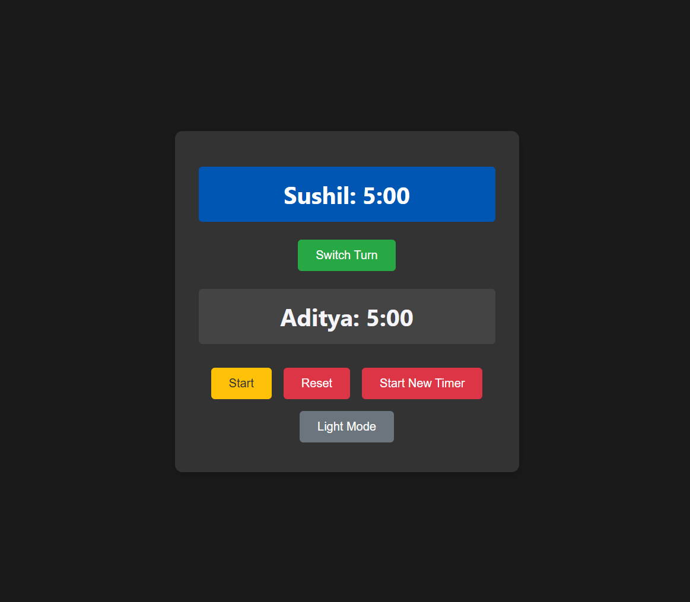

# Chess Clock App

 <!-- Add a screenshot of your app here -->

A simple and elegant chess clock app built with React. Perfect for managing time during chess games or any turn-based activities.

## Features

- **Player Names**: Enter names for Player 1 and Player 2.
- **Custom Timer**: Set a countdown timer for each player.
- **Switch Turns**: Easily switch between players' timers.
- **Start/Pause**: Start or pause the game at any time.
- **Reset**: Reset the timers to the initial value.
- **Dark Mode**: Toggle between light and dark themes for better visibility.

## Live Demo

Check out the live demo hosted on GitHub Pages:  
[Chess Clock Live Demo](https://sushilvatane.github.io/ChessClock)

## Screenshots

### Light Mode
 <!-- Add a screenshot of light mode -->

### Dark Mode
 <!-- Add a screenshot of dark mode -->

## Installation

To run this project locally, follow these steps:

1. **Clone the repository**:
   ```bash
   git clone https://github.com/sushlvatane/ChessClock.git
